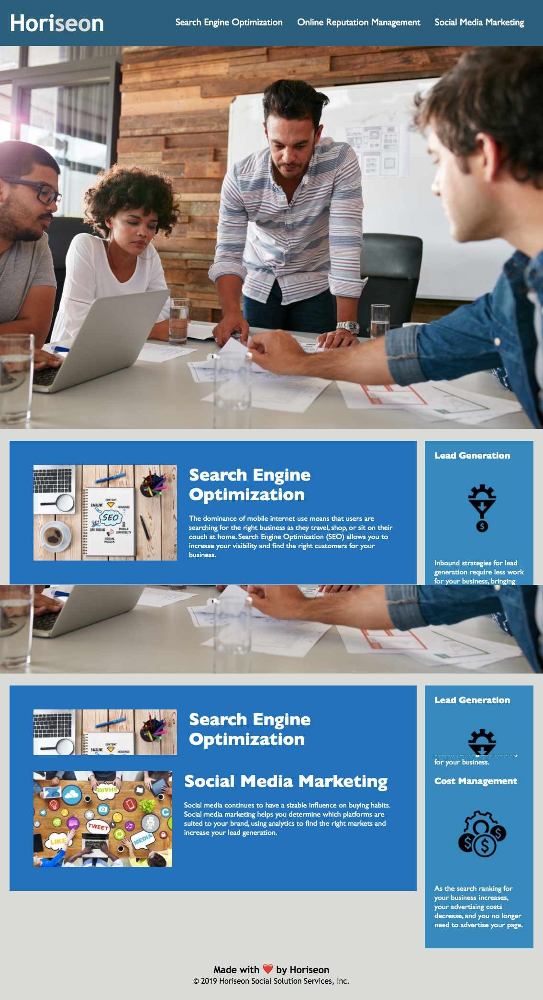

# HORISEONHOMEWORK

## Overview

Description 

This project was to improve the codebase for long-term sustainability and make sure that all links are functioning correctly. Also,to rework the CSS to make it more efficient by consolidating CSS selectors and properties, organizing them to follow the semantic structure of the HTML elements.

## Website Screenshot

## Installation

After accessing my repository on GitHub, open the index.html for this project on Chrome.

# Tasks completed 

Make code more accessible by using semantic tags insted of using dic only.
Add alt atrtrbutes with image tags. 
Ensure all links are functioning correctly, clean up the CSS to make it more efficient.
Fixed missing id to make menu link work correctly 

### __Credits__

- [W3schools](https://www.w3schools.com/)
- [GitHub](https://coding-boot-camp.github.io/full-stack/github/professional-readme-guide)
- [MDN](https://developer.mozilla.org/en-US/docs/Web/CSS/CSS_Selectors)

While working on this project, i was able to learn about semantic in HTML and how it accurately describes the purpose of the element.

### __License__
***
The MIT License (MIT)
Copyright © 2021 Sandhyapant

Permission is hereby granted, free of charge, to any person obtaining a copy of this software and associated documentation files (the “Software”), to deal in the Software without restriction, including without limitation the rights to use, copy, modify, merge, publish, distribute, sublicense, and/or sell copies of the Software, and to permit persons to whom the Software is furnished to do so, subject to the following conditions:

The above copyright notice and this permission notice shall be included in all copies or substantial portions of the Software.

THE SOFTWARE IS PROVIDED “AS IS”, WITHOUT WARRANTY OF ANY KIND, EXPRESS OR IMPLIED, INCLUDING BUT NOT LIMITED TO THE WARRANTIES OF MERCHANTABILITY, FITNESS FOR A PARTICULAR PURPOSE AND NONINFRINGEMENT. IN NO EVENT SHALL THE AUTHORS OR COPYRIGHT HOLDERS BE LIABLE FOR ANY CLAIM, DAMAGES OR OTHER LIABILITY, WHETHER IN AN ACTION OF CONTRACT, TORT OR OTHERWISE, ARISING FROM, OUT OF OR IN CONNECTION WITH THE SOFTWARE OR THE USE OR OTHER DEALINGS IN THE SOFTWARE.